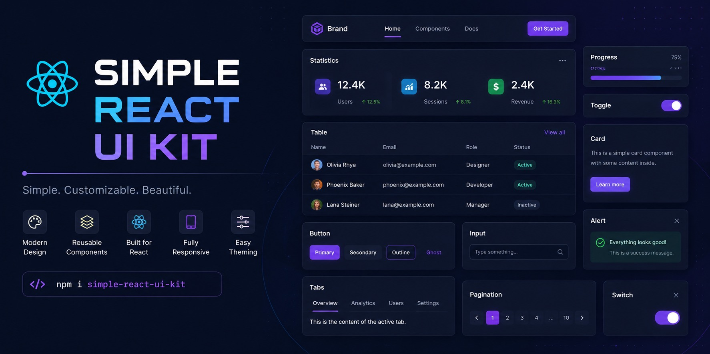

<a id="top"></a>

<!-- PROJECT TITLE -->

**Simple React UI Kit** is a lightweight, fully typed React component library for building modern web interfaces. It provides 16 production-ready UI components with full TypeScript support, a minimal bundle footprint, and deep theming capabilities via CSS variables — everything you need to ship consistent, accessible UIs faster.

<div align="center">
  

  <h3>Lightweight, accessible React UI components with full TypeScript support</h3>

<a href="https://miksrv.github.io/simple-react-ui-kit/" target="_blank">StoryBook</a>
·
<a href="CHANGELOG.md" target="_blank">Changelog</a>
·
<a href="https://github.com/miksrv/simple-react-ui-kit/issues/new?assignees=miksrv&labels=bug&projects=&template=1-bug.yml&title=%5BBug%5D%3A+">Report Bug</a>
·
<a href="https://github.com/miksrv/simple-react-ui-kit/issues/new?assignees=miksrv&labels=enhancement&template=2-feature-request.yml&title=%5BFeature%5D%3A+">Request Feature</a>
·
<a href="#contact">Contact</a>

</div>

<br />

<!-- PROJECT BADGES -->
<div align="center">

[![Contributors][contributors-badge]][contributors-url]
[![Forks][forks-badge]][forks-url]
[![Stargazers][stars-badge]][stars-url]
[![Issues][issues-badge]][issues-url]
[![MIT License][license-badge]][license-url]

[](https://github.com/miksrv/simple-react-ui-kit/actions/workflows/checks.yml)
[](https://github.com/miksrv/simple-react-ui-kit/actions/workflows/publish.yml)
[](https://github.com/miksrv/simple-react-ui-kit/actions/workflows/storybook.yml)
[](https://github.com/miksrv/simple-react-ui-kit/actions/workflows/sonarcloud.yml)

[](https://sonarcloud.io/summary/new_code?id=miksrv_simple-react-ui-kit)
[](https://sonarcloud.io/summary/new_code?id=miksrv_simple-react-ui-kit)
[](https://bundlephobia.com/result?p=simple-react-ui-kit)
[](https://npmtrends.com/simple-react-ui-kit)

</div>

<!-- TABLE OF CONTENTS -->

### Table of Contents

- [About the Project](#about-of-project)
    - [Built With](#built-with)
- [Installation](#installation)
- [Components](#usage)
    - [Badge](#badge)
    - [Button](#button)
    - [Calendar](#calendar)
    - [Checkbox](#checkbox)
    - [Container](#container)
    - [DatePicker](#datepicker)
    - [Dialog](#dialog)
    - [Icon](#icon)
    - [Input](#input)
    - [TextArea](#textarea)
    - [Message](#message)
    - [Popout](#popout)
    - [Progress](#progress)
    - [Select](#select)
    - [Skeleton](#skeleton)
    - [Spinner](#spinner)
    - [Table](#table)
- [Contributing](#contributing)
    - [Top Contributors](#top-contributors)
- [Style Variables Customization](#style-variables-customization)
- [License](#license)
- [Acknowledgments](#acknowledgments)

<!-- ABOUT OF PROJECT -->

## About the Project

**Simple React UI Kit** is an open-source React component library focused on developer experience, accessibility, and design flexibility. Built with TypeScript, Sass Modules, and Rollup, it delivers a minimal bundle footprint without sacrificing functionality.

### Key Features

1. **17 Production-Ready Components** — Badge, Button, Calendar, Checkbox, Container, DatePicker, Dialog, Icon, Input, Message, Popout, Progress, Select, Skeleton, Spinner, Table, and TextArea — all fully documented in Storybook.
2. **Full TypeScript Support** — Every component ships with strict type definitions and IntelliSense-friendly prop interfaces.
3. **Themeable via CSS Variables** — Override design tokens at the `:root` level to integrate any design system or dark-mode theme.
4. **Accessible by Default** — Components include proper ARIA attributes, keyboard navigation, and focus management out of the box.
5. **Minimal Bundle Size** — Bundled with Rollup and tree-shakeable; `react`, `react-dom`, and `dayjs` are peer dependencies rather than being bundled, so the host application's own instances are reused.

### Real-World Usage

One real-world application of this library is the interface for an IoT weather station. You can check out the live demo: [Weather Station Demo](https://meteo.miksoft.pro/). The source code is available in the [Weather Station Repository](https://github.com/miksrv/arduino-weather-station).

<p align="right">
  (<a href="#top">Back to top</a>)
</p>

### Built With

The project is built with a modern, battle-tested frontend stack.

- [![JavaScript][js-badge]][js-url] Core language powering the component logic.
- [![TypeScript][ts-badge]][ts-url] Strict static typing for safer, more maintainable code.
- [![Sass][sass-badge]][sass-url] Modular, component-scoped styling with Sass modules.
- [![GitHub Actions][githubactions-badge]][githubactions-url] CI/CD pipeline for automated testing, linting, and publishing.
- [![SonarCloud][sonarcloud-badge]][sonarcloud-url] Continuous code quality and security analysis.
- [![Jest][jest-badge]][jest-url] Unit testing with Jest and React Testing Library.

<p align="right">
  (<a href="#top">Back to top</a>)
</p>

<!-- INSTALLATION -->

## Installation

Install **Simple React UI Kit** via npm:

```sh
npm install simple-react-ui-kit
```

Or with Yarn:

```sh
yarn add simple-react-ui-kit
```

`react`, `react-dom`, and `dayjs` are peer dependencies and are not bundled — make sure they're installed in your project as well:

```sh
npm install react react-dom dayjs
```

Import the two stylesheets once in your app entry: the design tokens first, then the component styles, then your own overrides:

```ts
// Next.js: pages/_app.tsx · Vite/CRA: src/main.tsx
import 'simple-react-ui-kit/theme.css'
import 'simple-react-ui-kit/styles.css'
import './theme-overrides.css' // your overrides, loaded after the kit
```

The component styles are a regular stylesheet, not injected by JavaScript, so server-rendered pages (Next.js, Remix) are styled from the first paint.

<p align="right">
  (<a href="#top">Back to top</a>)
</p>

<!-- USAGE -->

## Usage

Each component is individually importable and fully typed. The examples below cover the most common use cases — refer to [Storybook](https://miksrv.github.io/simple-react-ui-kit/) for live interactive demos of every component and its props.

### Badge

The `Badge` component is a compact, stylized label for tagging and categorizing content. It supports an optional icon, a remove button with a callback, and three size variants.

<details>
  <summary>Badge Component Example</summary>

Check out the full documentation and examples in Storybook: [Badge Component Storybook](https://miksrv.github.io/simple-react-ui-kit/?path=/docs/components-badge--docs).

#### Props:

- **`key`**: A unique key for identifying the badge (optional).
- **`label`**: The text content inside the badge.
- **`icon`**: An optional icon to display alongside the badge text.
- **`size`**: Size of the badge (`small`, `medium`, `large`).
- **`onClickRemove`**: A callback function to handle removal of the badge. This is triggered when the remove button is clicked.

#### Example Usage:

```tsx
import React from 'react'
import { Badge } from 'simple-react-ui-kit'

const App = () => (
    <div>
        {/* Badge with label and icon */}
        <Badge
            label='New'
            icon='CheckCircle'
        />

        {/* Removable Badge */}
        <Badge
            label='Removable'
            onClickRemove={(key) => alert(`Removed: ${key}`)}
        />

        {/* Badge without icon */}
        <Badge label='Simple Badge' />
    </div>
)

export default App
```

In this example:

- The first badge displays a label and an icon.
- The second badge includes a removal button, which triggers an alert when clicked.
- The third badge is a simple label without an icon or removal option.

For more details and live examples, check out the [Storybook Documentation](https://miksrv.github.io/simple-react-ui-kit/?path=/docs/components-badge--docs).

</details>

### Button

The `Button` component is a versatile, accessible button with multiple visual modes, size variants, loading states, icon support, and optional link behavior.

<details>
  <summary>Button Component Example</summary>

Check out the full documentation and examples in Storybook: [Button Component Storybook](https://miksrv.github.io/simple-react-ui-kit/?path=/docs/components-button--docs).

#### Props:

- **`className`**: Additional class names for custom styling.
- **`link`**: If provided, the button acts as a link.
- **`noIndex`**: Prevents search engines from indexing the button when used as a link.
- **`stretched`**: If `true`, the button takes the full width of the container.
- **`loading`**: Shows a loading spinner instead of button content.
- **`size`**: Controls button size (`small`, `medium`, `large`).
- **`mode`**: Visual style of the button (`primary`, `secondary`, `outline`, `link`).
- **`variant`**: Variant for styling (`positive`, `negative`).
- **`unstyled`**: Strips the default chrome (background, padding, border-radius, min-height) while keeping the button's semantics — type, disabled, aria-busy/loading spinner, icon+label layout. Ignores `mode`/`variant`/`size`. Use for icon-only or fully custom-styled triggers (e.g. a burger menu button, a dialog close icon) instead of a raw `<button>`.
- **`icon`**: Displays an icon inside the button.
- **`children`**: React children to be displayed inside the button.
- **`label`**: Text content for the button.
- **`disabled`**: Disables the button. When used together with `link`, the anchor renders with `aria-disabled="true"`, `tabIndex={-1}`, and no `href`, making it non-navigable and accessible.

#### Example Usage:

```tsx
import React from 'react'
import { Button } from 'simple-react-ui-kit'

const App = () => (
    <div>
        {/* Primary Button */}
        <Button
            mode='primary'
            onClick={() => alert('Primary Button Clicked!')}
        >
            Primary Button
        </Button>

        {/* Secondary Button with Icon */}
        <Button
            mode='secondary'
            icon='CheckCircle'
            onClick={() => alert('Secondary Button Clicked!')}
        >
            Secondary Button
        </Button>

        {/* Button with Loading State */}
        <Button
            mode='primary'
            loading={true}
        >
            Loading...
        </Button>

        {/* Link Button */}
        <Button
            mode='link'
            link='https://example.com'
        >
            Visit Example
        </Button>
    </div>
)

export default App
```

In this example:

- The first button demonstrates a simple primary button with a click handler.
- The second button showcases a secondary button with an icon.
- The third button is in a loading state with a spinner.
- The fourth button acts as a link.

For more details and live examples, check out the [Storybook Documentation](https://miksrv.github.io/simple-react-ui-kit/?path=/docs/components-button--docs).

</details>

### Calendar

The `Calendar` component is an interactive date picker supporting single-date and date-range selection, `en`/`ru` localization, min/max date constraints, and keyboard navigation.

<details>
  <summary>Calendar Component Example</summary>

Check out the full documentation and examples in Storybook: [Calendar Component Storybook](https://miksrv.github.io/simple-react-ui-kit/?path=/docs/components-calendar--docs).

#### Props:

- **`hideDaysOfWeek`**: Hides the days of the week row if set to `true`.
- **`datePeriod`**: Tuple of start and end dates (`[string?, string?]`) for range selection.
- **`minDate`**: Minimum selectable date (`YYYY-MM-DD`).
- **`maxDate`**: Maximum selectable date (`YYYY-MM-DD`).
- **`locale`**: Locale for month and day names (`'ru'` or `'en'`).
- **`containerClassName`**: Additional class name for the calendar container.
- **`onDateSelect`**: Callback for single date selection.
- **`onPeriodSelect`**: Callback for period selection (start and end dates).

```tsx
import React, { useState } from 'react'
import { Calendar } from 'simple-react-ui-kit'

const App = () => {
    const [period, setPeriod] = useState<[string?, string?]>([])

    return (
        <div>
            <Calendar
                locale='en'
                minDate='2023-01-01'
                maxDate='2025-12-31'
                datePeriod={period}
                onPeriodSelect={(start, end) => setPeriod([start, end])}
            />
        </div>
    )
}

export default App
```

In this example:

- The Calendar allows selecting a date range between 2023-01-01 and 2025-12-31.
- The selected period is managed in React state and updated via the onPeriodSelect callback.
- The calendar is displayed in English.

For more details and live examples, check out the [Storybook Documentation](https://miksrv.github.io/simple-react-ui-kit/?path=/docs/components-calendar--docs).

</details>

### Checkbox

The `Checkbox` component is a fully controlled input that supports checked, unchecked, and indeterminate states, along with optional labels, disabled mode, and an accessible `onChange` handler.

<details>
  <summary>Checkbox Component Example</summary>

Check out the full documentation and examples in Storybook: [Checkbox Component Storybook](https://miksrv.github.io/simple-react-ui-kit/?path=/docs/components-checkbox--docs).

#### Props:

- **`label`**: Optional label to be displayed alongside the checkbox (can be a string or a ReactNode).
- **`indeterminate`**: If `true`, renders the checkbox in an indeterminate state.
- **`disabled`**: If `true`, disables the checkbox interaction.
- **`checked`**: Indicates whether the checkbox is checked (can be controlled via this prop).
- **`onChange`**: Function called when the checkbox state changes.
- **`id`**: Optional HTML `id` attribute, used to link the label with the checkbox.

#### Example Usage:

```tsx
import React from 'react'
import { Checkbox } from 'simple-react-ui-kit'

const App = () => (
    <div>
        {/* Basic Checkbox */}
        <Checkbox label='Basic Checkbox' />

        {/* Checked Checkbox */}
        <Checkbox
            label='Checked Checkbox'
            checked={true}
        />

        {/* Indeterminate Checkbox */}
        <Checkbox
            label='Indeterminate Checkbox'
            indeterminate={true}
        />

        {/* Disabled Checkbox */}
        <Checkbox
            label='Disabled Checkbox'
            disabled={true}
        />

        {/* Checkbox with onChange handler */}
        <Checkbox
            label='Interactive Checkbox'
            onChange={(e) => console.log(e.target.checked)}
        />
    </div>
)

export default App
```

In this example:

- The first checkbox is a basic checkbox with a label.
- The second checkbox is pre-checked using the `checked` prop.
- The third checkbox demonstrates the indeterminate state.
- The fourth checkbox is disabled and cannot be interacted with.
- The fifth checkbox includes an `onChange` handler to capture the change in its state.

For more details and live examples, check out the [Storybook Documentation](https://miksrv.github.io/simple-react-ui-kit/?path=/docs/components-checkbox--docs).

</details>

### Container

The `Container` component is a flexible layout wrapper for organizing content with optional title, action element, custom header, and footer sections — ideal for cards, panels, and page sections.

<details>
  <summary>Container Component Example</summary>

Check out the full documentation and examples in Storybook: [Container Component Storybook](https://miksrv.github.io/simple-react-ui-kit/?path=/docs/components-container--docs).

#### Props:

- **`className`**: Additional class names for custom styling.
- **`title`**: Optional title for the container, typically displayed in the header.
- **`action`**: Optional action element (button, link, etc.) displayed in the header.
- **`header`**: Custom header content, if different from the default title and action.
- **`children`**: Main content of the container.
- **`footer`**: Optional footer content, typically used for additional actions or information.

#### Example Usage:

```tsx
import React from 'react'
import { Container } from 'simple-react-ui-kit'

const App = () => (
    <div>
        {/* Basic Container with Title */}
        <Container title='Basic Container'>This is the main content inside the container.</Container>

        {/* Container with Custom Header and Footer */}
        <Container
            header={<div>Custom Header</div>}
            footer={<div>Footer Content</div>}
        >
            Content goes here...
        </Container>

        {/* Container with Action Button */}
        <Container
            title='Container with Action'
            action={<button onClick={() => alert('Action Clicked!')}>Action</button>}
        >
            This container has a button action in the header.
        </Container>

        {/* Custom Styled Container */}
        <Container className='custom-container-class'>This container has custom styles applied.</Container>
    </div>
)

export default App
```

In this example:

- The first container demonstrates a simple setup with a title and content.
- The second container includes a custom header and footer.
- The third container has an action button in the header.
- The fourth container shows how to apply custom styles via the `className` prop.

For more details and live examples, check out the [Storybook Documentation](https://miksrv.github.io/simple-react-ui-kit/?path=/docs/components-container--docs).

</details>

### DatePicker

The `DatePicker` component provides a user-friendly trigger button with a dropdown calendar for selecting single dates or date ranges. It includes built-in preset options (Today, Last Week, etc.) and is ideal for dashboards and report filters.

<details>
  <summary>DatePicker Component Example</summary>

Check out the full documentation and examples in Storybook: [DatePicker Component Storybook](https://miksrv.github.io/simple-react-ui-kit/?path=/docs/components-datepicker--docs).

#### Props:

- **`hidePresets`**: Array of preset keys to hide from the presets list.
- **`periodDatesFormat`**: Format for displaying period ranges (default: `DD.MM.YYYY`).
- **`singleDateFormat`**: Format for displaying a single date (default: `DD MMMM YYYY`).
- **`placeholder`**: Caption shown when no date is selected (default: `Select date`).
- **`disabled`**: Disables the date picker if `true`.
- **`buttonMode`**: Button mode for the trigger (`primary`, `secondary`, etc.).
- **`locale`**: Locale used to format the selected date/period text on the trigger button, the preset labels, and the calendar grid (`'ru'` or `'en'`, default: `'en'`). This is applied per-call and does not depend on (or mutate) the host application's global `dayjs` locale.
- All other `Calendar` props are supported.

> **Note:** `react`, `react-dom`, and `dayjs` are peer dependencies — the host application's own instances are used, so setting `dayjs.locale(...)` in your app does not affect this component's date formatting; pass the `locale` prop instead.

#### Example Usage:

```tsx
import React, { useState } from 'react'
import { DatePicker } from 'simple-react-ui-kit'

const App = () => {
    const [period, setPeriod] = useState<[string?, string?]>([])

    return (
        <DatePicker
            periodDatesFormat='DD.MM.YYYY'
            singleDateFormat='DD MMMM YYYY'
            onPeriodSelect={(start, end) => setPeriod([start, end])}
            placeholder='Choose a date'
            buttonMode='primary'
        />
    )
}

export default App
```

In this example:

- The `DatePicker` component allows users to select a date or date range.
- The selected period is stored in the `period` state variable.
- Custom date formats and captions are provided for better user experience.
- The button mode is set to `primary` for visual emphasis.

For more details and live examples, check out the [Storybook Documentation](https://miksrv.github.io/simple-react-ui-kit/?path=/docs/controls-datepicker--docs).

</details>

### Dialog

The `Dialog` component is an accessible modal with a backdrop overlay, configurable dimensions, back/close button controls, Escape key handling, and optional parent-relative positioning.

<details>
  <summary>Dialog Component Example</summary>

Check out the full documentation and examples in Storybook: [Dialog Component Storybook](https://miksrv.github.io/simple-react-ui-kit/?path=/docs/components-dialog--docs).

#### Props:

- **`open`**: Controls whether the dialog is open or closed.
- **`title`**: Title text displayed in the dialog header.
- **`contentHeight`**: Height of the dialog content (e.g., `300px`).
- **`maxWidth`**: Maximum width of the dialog (e.g., `500px`). Defaults to `500px`.
- **`showOverlay`**: Determines if the backdrop overlay is displayed. Defaults to `true`.
- **`backLinkCaption`**: Caption for the back button.
- **`showBackLink`**: Determines if the back button is displayed.
- **`showCloseButton`**: Determines if the close button is displayed.
- **`parentRef`**: Reference to the parent element for positioning the dialog.
- **`children`**: Content to be displayed inside the dialog.
- **`onBackClick`**: Callback function triggered when the back button is clicked.
- **`onCloseDialog`**: Callback function triggered when the dialog is closed (including Escape key).

#### Example Usage:

```tsx
import React, { useState, useRef } from 'react'
import { Dialog, Button } from 'simple-react-ui-kit'

const App = () => {
    const [isDialogOpen, setIsDialogOpen] = useState(false)
    const parentRef = useRef<HTMLDivElement | null>(null)

    return (
        <div
            ref={parentRef}
            style={{ position: 'relative', height: '300px' }}
        >
            <Button onClick={() => setIsDialogOpen(true)}>Open Dialog</Button>
            <Dialog
                open={isDialogOpen}
                title='Dialog Header'
                contentHeight='200px'
                maxWidth='400px'
                backLinkCaption='Back'
                showBackLink
                parentRef={parentRef}
                onBackClick={() => alert('Back button clicked!')}
                onCloseDialog={() => setIsDialogOpen(false)}
            >
                <p>This is the dialog content!</p>
                <Button onClick={() => setIsDialogOpen(false)}>Close Dialog</Button>
            </Dialog>
        </div>
    )
}

export default App
```

In this example:

- The `Dialog` is opened and closed using the `isDialogOpen` state.
- The `backLinkCaption` and `showBackLink` props enable a back button with a custom caption.
- The dialog is positioned relative to the `parentRef` container.

For more detailed examples and live usage, check out the [Storybook Documentation](https://miksrv.github.io/simple-react-ui-kit/?path=/docs/components-dialog--docs).

</details>

### Icon

The `Icon` component renders scalable SVG icons by name, accepting any additional SVG attributes for full customization. Use it in buttons, navigation items, or anywhere consistent iconography is needed.

<details>
  <summary>Icon Component Example</summary>

Explore the full documentation and examples in Storybook: [Icon Component Storybook](https://miksrv.github.io/simple-react-ui-kit/?path=/docs/components-icon--docs).

#### Props:

- **`name`**: Required. The icon identifier — must match one of the predefined icon names.
- **`className`**: Optional class name for custom styling.
- **`...props`**: Any additional `SVGSVGElement` attributes (`onClick`, `style`, `width`, `height`, etc.) passed directly to the SVG.

#### Example Usage:

```tsx
import React from 'react'
import { Icon } from 'simple-react-ui-kit'

const App = () => {
    return (
        <div>
            <h1>My Application</h1>
            <Icon
                name='Search'
                className='icon-search'
            />
            <Icon
                name='Settings'
                className='icon-settings'
            />
            <Icon
                name='User'
                className='icon-user'
            />
        </div>
    )
}

export default App
```

In this example, `Search`, `Settings`, and `User` icons are rendered with custom class names for styling.

For more detailed examples and interactive demonstrations, visit the [Storybook Documentation](https://miksrv.github.io/simple-react-ui-kit/?path=/docs/components-icon--docs).

</details>

### Input

The `Input` component is a fully featured form field with label, error message, required indicator, and disabled state support. It extends all standard `HTMLInputElement` attributes for maximum flexibility.

<details>
  <summary>Input Component Example</summary>

Check out the full documentation and examples in Storybook: [Input Component Storybook](https://miksrv.github.io/simple-react-ui-kit/?path=/docs/components-input--docs).

#### Props:

- **`label`**: Optional label text displayed above the input field.
- **`mode`**: Visual style of the input field (`primary`, `ghost`). Defaults to `primary`.
- **`size`**: Size of the input field, can be `small`, `medium` or `large`.
- **`error`**: Error message displayed below the input field, used for validation feedback. Accepts a `string` (message shown below the field) or `true` (applies the red/invalid border only, without rendering a message — useful when several fields share one message shown once elsewhere, e.g. a field group).
- **`clearable`**: When `true`, shows a clear button (×) on the right side of the input when it has a value. Clicking the button clears the input and triggers `onChange` with an empty value. The button is hidden when the input is empty or disabled.
- **`icon`**: Icon displayed on the left side of the input field. Accepts any valid icon name from the `IconTypes` union. The input text is automatically padded to avoid overlapping the icon.
- **`className`**: Additional class names for custom styling.
- **`required`**: Marks the input as required.
- **`disabled`**: Disables the input, preventing user interaction.

Additionally, the `Input` component accepts all standard input attributes from `React.InputHTMLAttributes<HTMLInputElement>`, making it flexible for various input scenarios (e.g., `type`, `placeholder`, `value`, etc.).

#### Example Usage:

```tsx
import React, { useState } from 'react'
import { Input } from 'simple-react-ui-kit'

const App = () => {
    const [inputValue, setInputValue] = useState<string>('')
    const [error, setError] = useState<string | undefined>()

    const handleInputChange = (e: React.ChangeEvent<HTMLInputElement>) => {
        const value = e.target.value
        setInputValue(value)
        setError(value.length < 3 ? 'Input must be at least 3 characters long.' : undefined)
    }

    return (
        <div>
            <Input
                label='Username'
                placeholder='Enter your username'
                value={inputValue}
                onChange={handleInputChange}
                required
                error={error}
            />

            {/* Clearable input example */}
            <Input
                label='Search'
                placeholder='Type to search...'
                value={inputValue}
                onChange={handleInputChange}
                clearable
            />
        </div>
    )
}

export default App
```

In this example:

- The `Input` component displays a label and an error message if the input text is too short.
- The input's required attribute visually indicates that it's a required field.
- The input value is managed with React state, and validation logic sets an error message conditionally.
- The second input demonstrates the `clearable` prop, which shows a clear button when the input has a value.
- Passing `error={true}` instead of a string highlights the field in red without rendering a message — handy for a field in a group validated as a whole (see the [Storybook "With Error (highlight only)" story](https://miksrv.github.io/simple-react-ui-kit/?path=/docs/components-input--docs)).

For more detailed examples and live usage, check out the [Storybook Documentation](https://miksrv.github.io/simple-react-ui-kit/?path=/docs/components-input--docs).

</details>

### TextArea

The `TextArea` component is a multi-line text input with label, error message, required indicator, and disabled state support. Wraps the native `<textarea>` element.

<details>
  <summary>TextArea Component Example</summary>

Check out the full documentation and examples in Storybook: [TextArea Component Storybook](https://miksrv.github.io/simple-react-ui-kit/?path=/docs/controls-textarea--docs).

#### Props:

- **`label`**: Optional label text displayed above the textarea.
- **`mode`**: Visual style of the textarea (`primary`, `ghost`). Defaults to `primary`.
- **`size`**: Size of the textarea, can be `small`, `medium` or `large`.
- **`error`**: Error message displayed below the textarea, used for validation feedback. Accepts a `string` (message shown below the field) or `true` (applies the red/invalid border only, without rendering a message — useful when several fields share one message shown once elsewhere, e.g. a field group).
- **`resize`**: Controls resize behavior of the textarea (`none`, `vertical`, `horizontal`, `both`). Defaults to `vertical`.
- **`autoResize`**: When `true`, the textarea height grows automatically to fit its content. The resize handle is hidden when this is active. Defaults to `false`.
- **`className`**: Additional class names for custom styling.
- **`required`**: Marks the textarea as required.
- **`disabled`**: Disables the textarea, preventing user interaction.

Additionally, the `TextArea` component accepts all standard textarea attributes from `React.TextareaHTMLAttributes<HTMLTextAreaElement>`, making it flexible for various use cases (e.g., `rows`, `placeholder`, `value`, etc.).

#### Example Usage:

```tsx
import React, { useState } from 'react'
import { TextArea } from 'simple-react-ui-kit'

const App = () => {
    const [value, setValue] = useState<string>('')
    const [error, setError] = useState<string | undefined>()

    const handleChange = (e: React.ChangeEvent<HTMLTextAreaElement>) => {
        const text = e.target.value
        setValue(text)
        setError(text.length > 0 && text.length < 10 ? 'Comment must be at least 10 characters long.' : undefined)
    }

    return (
        <div>
            <TextArea
                label='Comment'
                placeholder='Write your comment...'
                value={value}
                onChange={handleChange}
                required
                rows={4}
                error={error}
            />
        </div>
    )
}

export default App
```

In this example:

- The `TextArea` component displays a label and an error message if the text is too short.
- The required attribute visually indicates that it's a required field.
- The textarea value is managed with React state, and validation logic sets an error message conditionally.
- Passing `error={true}` instead of a string highlights the field in red without rendering a message — handy for a field in a group validated as a whole.

For more detailed examples and live usage, check out the [Storybook Documentation](https://miksrv.github.io/simple-react-ui-kit/?path=/docs/controls-textarea--docs).

</details>

### Message

The `Message` component renders styled notification banners in four semantic variants — `error`, `warning`, `success`, and `info` — with an optional title and arbitrary React content.

<details>
  <summary>Message Component Example</summary>

Check out the full documentation and examples in Storybook: [Message Component Storybook](https://miksrv.github.io/simple-react-ui-kit/?path=/docs/components-message--docs).

#### Props:

- **`type`**: Defines the visual style of the message. Accepts one of the following values: `'error'`, `'warning'`, `'success'`, or `'info'`.
- **`title`**: The title of the message that appears at the top (optional).
- **`children`**: The content inside the message box, which can be any React node (optional).

#### Example Usage:

```tsx
import React from 'react'
import { Message } from 'simple-react-ui-kit'

const App = () => (
    <div>
        {/* Error message with title and content */}
        <Message
            type='error'
            title='Error!'
        >
            There was an issue with your request.
        </Message>

        {/* Success message without title */}
        <Message type='success'>Operation completed successfully!</Message>

        {/* Info message with custom content */}
        <Message
            type='info'
            title='Information'
        >
            <ul>
                <li>First info item</li>
                <li>Second info item</li>
            </ul>
        </Message>
    </div>
)

export default App
```

In this example:

- The first `Message` displays an error with a title and content.
- The second `Message` shows a success message without a title.
- The third `Message` provides information with a custom list as its content.

For more details and live examples, check out the [Storybook Documentation](https://miksrv.github.io/simple-react-ui-kit/?path=/docs/components-message--docs).

</details>

### Popout

The `Popout` component is a floating panel triggered by a button, typically used for dropdown menus or contextual actions. It supports left/right positioning, portal rendering for overflow-hidden containers, auto-repositioning on scroll and resize, and an imperative `close()` handle.

<details>
  <summary>Popout Component Example</summary>

Explore the full documentation and examples in Storybook: [Popout Component Storybook](https://miksrv.github.io/simple-react-ui-kit/?path=/docs/components-popout--docs).

#### Props:

- **`className`**: Additional class names for custom styling.
- **`disabled`**: Disables the popout trigger, preventing the popout from opening.
- **`position`**: Position of the popout relative to the trigger element. Possible values: `'left'` or `'right'`.
- **`trigger`**: The content inside the button that triggers the popout (could be text, an icon, or a React node).
- **`children`**: The content to display inside the popout when it's open.
- **`closeOnChildrenClick`**: A boolean flag that, when set to `true`, closes the popout when any child inside the popout is clicked.
- **`onOpenChange`**: Callback function triggered when isOpen state changes.
- **`portal`**: When set to `true`, renders the popout content with fixed positioning (useful inside fixed or overflow-hidden containers).

#### Example Usage:

```tsx
import React, { useRef } from 'react'
import { Popout, PopoutHandleProps } from 'simple-react-ui-kit'

const App = () => {
    const popoutRef = useRef<PopoutHandleProps>(null)

    const handleClosePopout = () => {
        if (popoutRef.current) {
            popoutRef.current.close()
        }
    }

    return (
        <div>
            <Popout
                ref={popoutRef}
                position='right'
                trigger='Open Popout'
                closeOnChildrenClick={true}
            >
                <div>
                    <p>Popout Content</p>
                    <button onClick={handleClosePopout}>Close</button>
                </div>
            </Popout>
        </div>
    )
}

export default App
```

In this example:

- The `Popout` component is positioned to the right of the trigger button.
- The `closeOnChildrenClick` prop is set to `true`, meaning the popout will close when any of its children are clicked.
- A reference to the popout is used to manually close it via the `close` function.

#### Imperative Handle:

The `Popout` component provides an imperative handle with a `close()` method, which allows programmatic control over closing the popout.

For more detailed examples and interactive demonstrations, visit the [Storybook Documentation](https://miksrv.github.io/simple-react-ui-kit/?path=/docs/components-popout--docs).

</details>

### Select

The `Select` component is a fully featured dropdown with single and multi-select modes, search filtering, clear button, async loading state, portal rendering, and ARIA accessibility. It auto-repositions on scroll and resize to stay correctly anchored in any layout.

<details>
  <summary>Select Component Example</summary>

Check out the full documentation and examples in Storybook: [Select Component Storybook](https://miksrv.github.io/simple-react-ui-kit/?path=/docs/controls-select--docs).

#### Props:

- **`options`**: Array of selectable options, each with a `key` and `value`.
- **`value`**: Selected value(s); can be a single key or an array of keys for multiple selection.
- **`multiple`**: Enables multiple selection mode.
- **`searchable`**: Allows searching/filtering options.
- **`clearable`**: Shows a button to clear the selection.
- **`loading`**: Displays a loading spinner in the dropdown.
- **`closeOnSelect`**: Whether the dropdown closes after selecting an option (default: `true`).
- **`size`**: Size of the select field (`small`, `medium`, `large`).
- **`label`**: Optional label for the select field.
- **`placeholder`**: Placeholder text when nothing is selected.
- **`notFoundCaption`**: Text shown when no options match the search.
- **`error`**: Error message for validation feedback. Accepts a `string` (message shown below the field) or `true` (applies the red/invalid border only, without rendering a message — useful when several fields share one message shown once elsewhere, e.g. a field group).
- **`required`**: Marks the field as required.
- **`disabled`**: Disables the select. The component uses `aria-disabled` for accessibility.
- **`icon`**: Icon displayed on the left side of the select trigger. Accepts any valid icon name from the `IconTypes` union. Useful for adding visual context to the field (e.g., a search or category icon).
- **`onSelect`**: Callback when the selection changes.
- **`onSearch`**: Callback when the search input changes.
- **`onOpen`**: Callback when the dropdown is opened.

#### Example Usage:

```tsx
import React, { useState } from 'react'
import { Select } from 'simple-react-ui-kit'

const options = [
    { key: 'apple', value: 'Apple' },
    { key: 'banana', value: 'Banana' },
    { key: 'orange', value: 'Orange' }
]

const App = () => {
    const [selected, setSelected] = useState<string | undefined>()

    return (
        <Select
            options={options}
            value={selected}
            onSelect={(opts) => setSelected(opts?.[0]?.key)}
            label='Choose a fruit'
            placeholder='Select...'
            clearable
            searchable
        />
    )
}

export default App
```

In this example:

- The `Select` component displays a searchable dropdown of fruits.
- The user can clear the selection or search for an option.
- The selected value is managed in React state.
- Passing `error={true}` instead of a string highlights the field in red without rendering a message — handy for a field in a group validated as a whole.
- For more details and live examples, check out the Storybook Documentation.

#### Autocomplete Mode

When `options` is initially empty and `onSearch` is provided, the component operates in **autocomplete mode**: the toggle arrow and dropdown are automatically hidden until the user types something. As soon as the user enters text, `onSearch` fires — the parent fetches matching options asynchronously and passes them back via the `options` prop. Once options arrive, the dropdown opens normally. If the search yields no matches, the `notFoundCaption` is shown (which is the intended UX for an explicit search with no results).

This behaviour requires no extra props — it is automatic whenever `options.length === 0` and the search field is empty.

```tsx
import React, { useState } from 'react'
import { Select, SelectOptionType } from 'simple-react-ui-kit'

const allOptions: Array<SelectOptionType<number>> = [
    { key: 1, value: 'Apple' },
    { key: 2, value: 'Banana' },
    { key: 3, value: 'Cherry' },
    { key: 4, value: 'Date' },
    { key: 5, value: 'Elderberry' }
]

const AutocompleteExample = () => {
    const [search, setSearch] = useState<string>('')
    const [loading, setLoading] = useState(false)
    const [selected, setSelected] = useState<number | undefined>()

    const filteredOptions = search ? allOptions.filter((o) => o.value.toLowerCase().includes(search.toLowerCase())) : []

    const handleSearch = (text?: string) => {
        if (!!text?.length) {
            setSearch(text)
        }

        setLoading(true)
        setTimeout(() => {
            setLoading(false)
        }, 500)
    }

    const handleSelect = (selection: Array<SelectOptionType<number>> | undefined) => {
        const key = selection?.[0]?.key
        setSelected(key)
        if (!key) {
            setSearch('')
        }
    }

    return (
        <Select
            options={filteredOptions}
            value={selected}
            loading={loading}
            searchable
            notFoundCaption='No results found'
            placeholder='Start typing to search...'
            onSearch={handleSearch}
            onSelect={handleSelect}
        />
    )
}

export default AutocompleteExample
```

</details>

### Skeleton

The `Skeleton` component is an animated loading placeholder that mimics the shape of content while it is being fetched, reducing perceived load time and layout shift.

<details>
  <summary>Skeleton Component Example</summary>

Explore the full documentation and examples in Storybook: [Skeleton Component Storybook](https://miksrv.github.io/simple-react-ui-kit/?path=/docs/components-skeleton--docs).

#### Props:

- **`className`**: Additional class names to match the skeleton's shape and size to the content it represents.
- **`...props`**: All standard `HTMLDivElement` attributes are accepted (`style`, `width`, `height`, etc.).

#### Example Usage:

```tsx
import React from 'react'
import { Skeleton } from 'simple-react-ui-kit'

const App = () => {
    return (
        <div>
            <h1>Loading Content</h1>
            <Skeleton style={{ width: '100%', height: '200px' }} />
        </div>
    )
}

export default App
```

In this example, the skeleton fills a `200px`-tall block as a placeholder while content loads. Use the `className` prop or inline styles to match any shape — text lines, image blocks, or card layouts.

For more detailed examples and interactive demonstrations, visit the [Storybook Documentation](https://miksrv.github.io/simple-react-ui-kit/?path=/docs/components-skeleton--docs).

</details>

### Spinner

The `Spinner` component is an SVG-based animated loading indicator that signals ongoing processes such as data fetching or form submission.

<details>
  <summary>Spinner Component Example</summary>

Explore the full documentation and examples in Storybook: [Spinner Component Storybook](https://miksrv.github.io/simple-react-ui-kit/?path=/docs/components-spinner--docs).

#### Props:

- **`className`**: Additional class names for custom styling.
- **`...props`**: All standard `SVGSVGElement` attributes are accepted (`width`, `height`, `style`, etc.).

#### Example Usage:

```tsx
import React from 'react'
import { Spinner } from 'simple-react-ui-kit'

const App = () => {
    return (
        <div>
            <h1>Loading...</h1>
            <Spinner
                className='custom-spinner'
                width={50}
                height={50}
            />
        </div>
    )
}

export default App
```

In this example, `width` and `height` control the spinner size, and `className` applies custom styles.

For more detailed examples and interactive demonstrations, visit the [Storybook Documentation](https://miksrv.github.io/simple-react-ui-kit/?path=/docs/components-spinner--docs).

</details>

### Table

The `Table` component renders structured data with sortable columns, sticky headers, skeleton loading states, custom cell formatters, and optional vertical borders — suitable for dashboards, reports, and data management interfaces.

<details>
  <summary>Table Component Example</summary>

Explore the full documentation and examples in Storybook: [Table Component Storybook](https://miksrv.github.io/simple-react-ui-kit/?path=/docs/components-table--docs).

#### Props:

- **`data`**: An optional array of data objects to be displayed in the table. Each object corresponds to a row in the table.
- **`size`**: Size of the table columns and rows, can be `small`, `medium` or `large`.
- **`defaultSort`**: An optional configuration object for default sorting behavior. It defines the key and direction (ascending or descending) for initial sorting.
- **`className`**: Additional class names for custom styling, allowing you to integrate your CSS styles.
- **`height`**: Specifies the table height in pixels or allows auto height if set to `null`.
- **`maxHeight`**: The maximum height of the table, if there is little data, the table will not stretch.
- **`columns`**: An array defining the column configurations, including header content, accessor keys, sortability, and custom formatters.
- **`loading`**: A boolean that indicates whether the table is in a loading state. When `true`, skeleton placeholders are displayed instead of data.
- **`stickyHeader`**: A boolean that, when set to `true`, keeps the table header fixed at the top during scrolling.
- **`verticalBorder`**: A boolean to control the visibility of vertical borders between columns for improved readability.
- **`noDataCaption`**: Text to display when there is no data available in the table.

#### Example Usage:

```tsx
import React from 'react'
import { Table } from 'simple-react-ui-kit'

const App = () => {
    const data = [
        { id: 1, name: 'Item 1', price: 100 },
        { id: 2, name: 'Item 2', price: 200 }
    ]

    const columns = [
        { header: 'ID', accessor: 'id', isSortable: true },
        { header: 'Name', accessor: 'name', isSortable: true },
        { header: 'Price', accessor: 'price', isSortable: true, formatter: (value) => `$${value}` }
    ]

    return (
        <Table
            data={data}
            columns={columns}
            defaultSort={{ key: 'name', direction: 'asc' }}
            loading={false}
            stickyHeader
        />
    )
}

export default App
```

In this example, the table renders two rows with sortable columns and a `formatter` that adds a currency symbol to the price column. Set `loading={true}` to show skeleton placeholders during async data fetching.

For more detailed examples and interactive demonstrations, visit the [Storybook Documentation](https://miksrv.github.io/simple-react-ui-kit/?path=/docs/components-table--docs).

</details>

### Progress

The `Progress` component renders a horizontal progress bar with configurable percentage value, height, and color theme (`main`, `red`, `orange`, `green`).

<details>
  <summary>Progress Component Example</summary>

Check out the full documentation and examples in Storybook: [Progress Component Storybook](https://miksrv.github.io/simple-react-ui-kit/?path=/docs/components-progress--docs).

#### Props:

- **`value`**: Current progress value (percentage, from 0 to 100).
- **`height`**: Height of the progress bar in pixels.
- **`color`**: Color theme for the progress bar (`main`, `red`, `orange`, `green`).
- **`className`**: Additional class names for custom styling.

#### Example Usage:

```tsx
import React from 'react'
import { Progress } from 'simple-react-ui-kit'

const App = () => (
    <div>
        {/* Default progress bar */}
        <Progress value={50} />

        {/* Custom height and color */}
        <Progress
            value={75}
            height={8}
            color='green'
        />

        {/* Progress bar with custom styles */}
        <Progress
            value={30}
            className='my-progress-bar'
        />
    </div>
)

export default App
```

In this example:

- The first progress bar shows 50% completion with default height and color.
- The second bar is 75% complete, taller, and uses the green color theme.
- The third bar demonstrates adding a custom CSS class.

- For more details and live examples, check out the [Storybook Documentation](https://miksrv.github.io/simple-react-ui-kit/?path=/docs/components-progress--docs).

</details>

<p align="right">
  (<a href="#top">Back to top</a>)
</p>

<!-- STYLE VARIABLES CUSTOMIZATION -->

## Style Variables Customization

### Style Customization and Theming

Every component is styled only through CSS custom properties. The tokens ship as a plain stylesheet — import it once in your app entry, then override any token in your own stylesheet. No build step or config required.

```ts
// Next.js: pages/_app.tsx · Vite/CRA: src/main.tsx
import 'simple-react-ui-kit/theme.css'
import 'simple-react-ui-kit/styles.css'
import './theme-overrides.css' // your overrides, loaded after the kit
```

`theme.css` defines variables only. It does not style `body` or any element, so apply the page background, text colour and font yourself:

```css
body {
    background: var(--body-background);
    color: var(--text-color-primary);
    font: var(--font-size) / var(--line-height) var(--font-family);
}
```

#### Token layers

Tokens are organised in three layers. Override at the level that matches the scope of the change — a semantic token restyles every component that uses it, a component token touches one component.

| Layer         | Prefixes                                                                                                         | Purpose                                                              |
| ------------- | ---------------------------------------------------------------------------------------------------------------- | -------------------------------------------------------------------- |
| 1. Primitives | `--size-*`, `--space-*`, `--radius-*`, `--font-*`, `--line-height`, `--duration-*`, `--ease`, `--z-*`            | Raw scales, theme-independent                                        |
| 2. Semantic   | `--body-background`, `--surface-*`, `--border*`, `--text-color-*`, `--color-*`, `--shadow-*`, `--focus-*`        | Meaning, not usage. Light values on `:root`, dark under `data-theme` |
| 3. Component  | `--input-*`, `--button-*`, `--badge-*`, `--container-*`, `--dialog-*`, `--popout-*`, `--table-*`, `--tooltip-*`… | Aliases over layer 2 for one component family                        |

#### 1. Primitives

- **Control heights (`size` prop):**
    - `--size-small` / `--size-medium` / `--size-large` — global fallback for all sized components (`28px` / `36px` / `44px`).
    - `--size-control-*` — `Input`, `Select`, `Button`, `TextArea` (default: inherit `--size-*`).
    - `--size-badge-*` — `Badge` (`20px` / `24px` / `28px`).
    - `--size-table-*` — `Table` row heights (`32px` / `40px` / `48px`).
- **Spacing (4px grid):** `--space-1` … `--space-6` = `4px`, `8px`, `12px`, `16px`, `20px`, `24px`.
- **Radii:** `--radius-xs` `2px`, `--radius-sm` `4px`, `--radius-md` `6px`, `--radius-lg` `8px`, `--radius-xl` `12px`, `--radius-full`. Controls use `md`, menus `lg`, cards and dialogs `xl`. `--border-radius` is kept as the legacy alias for the control radius.
- **Typography:** `--font-family`, `--font-size-small` `12px`, `--font-size` `14px`, `--font-size-large` `16px`, `--line-height` `1.5`, `--font-weight-normal` / `-medium` / `-semibold`.
- **Motion:** `--duration-fast` `150ms`, `--duration-base` `200ms`, `--duration-slow` `300ms`, `--ease`. Animations respect `prefers-reduced-motion`.
- **Layers:** `--z-dropdown` `405`, `--z-overlay` `500`, `--z-dialog` `600`, `--z-tooltip` `10000`.

#### 2. Semantic

- **Surfaces:** `--body-background` (page), `--surface-1` (card), `--surface-2` (nested / hover), `--surface-3` (pressed).
- **Borders:** `--border` (hairline for cards and separators), `--border-strong` (form controls).
- **Text:** `--text-color-primary`, `--text-color-secondary`, `--text-color-secondary-hover`, `--text-color-disabled`, `--color-contrast` (text on coloured fills).
- **Shadows:** `--shadow-sm` / `--shadow-md` / `--shadow-lg`, tinted with `--ink-rgb`.
- **Brand:** `--color-main`, `--color-main-hover`, `--color-main-active`, `--color-main-background`.
- **Status:** `--color-green|orange|red`, each with `-hover`, `-active` and a pale `-background` tint.
- **Focus:** `--focus-ring` (soft 3px ring on text fields, built from `--focus-ring-color`), `--focus-outline` (solid 2px outline on buttons and other controls).

#### 3. Component

- **Container:** `--container-background-color`, `--container-shadow`, `--container-radius`, `--container-padding`, `--container-error-*`, `--container-success-*`.
- **Dialog / Overlay:** `--modal-background`, `--dialog-radius`, `--dialog-shadow`, `--overlay-background`.
- **Popout / dropdowns:** `--popout-radius`, `--popout-shadow`, `--dropdown-background-color`, `--dropdown-background-color-hover`, `--dropdown-badge-background-color`.
- **Form fields (`Input`, `TextArea`, `Select`):** `--input-radius`, `--input-background-color`, `--input-disabled-background-color`, `--input-border`, `--input-border-color`, `--input-border-focus-color`, `--input-placeholder-color`, `--input-label-color`, `--input-label-font-size`, `--input-label-font-weight`, `--input-label-gap`, `--input-hint-font-size`.
- **Button:** `--button-radius`, `--button-font-weight`, `--button-default-*`, `--button-primary-*`, `--button-secondary-*` (each with `color`, `background`, `background-hover`, `background-active`), `--button-outline-color`, `--button-outline-border-color`, `--button-outline-border-color-hover`, `--button-link-color`, `--button-link-color-hover`.
- **Badge:** `--badge-radius`, `--badge-background`, `--badge-border-color`.
- **Message:** `--message-radius`.
- **Tooltip:** `--tooltip-radius`, `--tooltip-background`, `--tooltip-color`.
- **Table:** `--table-header-background`, `--table-header-background-hover`, `--table-border-color`, `--table-row-box-shadow`.
- **Progress:** `--progress-radius`, `--progress-background`.
- **Skeleton:** `--skeleton-radius`, `--skeleton-background`, `--skeleton-background-animation`.

The full list with default values is in [`src/styles/theme.css`](src/styles/theme.css); the "Foundations / Design Tokens" page in Storybook renders them live.

#### Dark theme

A dark colour set ships in the same file under `[data-theme='dark']`. Set the attribute on `<html>` to switch the whole page, or on any element to make only that subtree dark (a sidebar, a preview panel):

```html
<html data-theme="dark"></html>

<aside data-theme="dark">…only this subtree is dark…</aside>
```

Only colours change between themes; sizes, radii and motion are shared. To tune the dark palette, override tokens under the same selector:

```css
[data-theme='dark'] {
    --surface-1: #1e1f22;
    --color-main: #6aa6f0;
}
```

If you add your own alias tokens (a token whose value is `var(--another-token)`), declare them on `:root, [data-theme]` rather than on `:root` alone. A `var()` inside a custom property is resolved on the element that declares it, so an alias declared only on `:root` keeps the root value inside a themed subtree.

#### Example: project overrides

Keep your override file to the tokens you actually change. Everything else inherits the kit defaults.

```css
/* theme-overrides.css — loaded after simple-react-ui-kit/theme.css */
:root {
    /* Brand */
    --color-main: #3770b1;
    --color-main-hover: #2f64a0;
    --color-main-active: #295891;
    --color-main-background: #e3eefb;

    /* Denser controls and a softer radius */
    --size-control-medium: 34px;
    --border-radius: var(--radius-sm);
    --container-radius: var(--radius-lg);

    /* Filled fields instead of outlined */
    --input-background-color: var(--surface-2);
}

:root[data-theme='dark'] {
    --color-main: #4f93e6;
    --color-main-background: #243a55;
}
```

Upgrading from a version before `theme.css`? See [`MIGRATION.md`](MIGRATION.md) for the token rename table and the list of visual changes.

<!-- CONTRIBUTING -->

## Contributing

Contributions of all kinds are welcome — bug reports, feature requests, documentation improvements, and pull requests.

**To contribute:**

1. Fork the project.
2. Create your feature branch (`git checkout -b feature/AmazingFeature`).
3. Commit your changes (`git commit -m 'Add AmazingFeature'`).
4. Push to the branch (`git push origin feature/AmazingFeature`).
5. Open a pull request.

For more detailed contributing guidelines, see [CONTRIBUTING.md](CONTRIBUTING.md).

### Releasing a New Version

Once a pull request is merged into `main`, follow these steps to publish a release:

1. After your pull request is merged, run the command `yarn changeset` to begin the release process.
2. Select the type of changes (major, minor, patch) and enter a detailed description of the changes.
3. This will create a markdown file in the `.changeset` directory describing the changes.

    **Important:** If you don't proceed with the next command, the release will be postponed.

4. To trigger the release process after the merge into `main`, run the command `yarn changeversion`. This will:
    - Update the version number in the `package.json`.
    - Update the `CHANGELOG.md` with the list of changes.

Once this is done, merging this branch into `main` will automatically publish a new release.

### Top contributors

<a href="https://github.com/miksrv/simple-react-ui-kit/graphs/contributors">
  
</a>

<p align="right">
  (<a href="#top">Back to top</a>)
</p>

<!-- LICENSE -->

## License

Distributed under the MIT License. See [LICENSE](LICENSE) for details.

<p align="right">
  (<a href="#top">Back to top</a>)
</p>

<!-- ACKNOWLEDGMENTS -->

## Acknowledgments

Resources and tools that were helpful during the development of this project:

1. [GitHub Readme Template](https://github.com/miksrv/GitHub-Project-README-Template)
2. [React Documentation](https://react.dev/)
3. [Sass Documentation](https://sass-lang.com/)
4. [Jest Testing Framework](https://jestjs.io/)

<p align="right">
  (<a href="#top">Back to top</a>)
</p>

<!-- CONTACT -->

## Contact

Misha - [miksoft.pro](https://miksoft.pro)

<p align="right">
  (<a href="#top">Back to top</a>)
</p>

<!-- MARKDOWN VARIABLES (LINKS, IMAGES) -->

[contributors-badge]: https://img.shields.io/github/contributors/miksrv/simple-react-ui-kit.svg?style=for-the-badge
[contributors-url]: https://github.com/miksrv/simple-react-ui-kit/graphs/contributors
[forks-badge]: https://img.shields.io/github/forks/miksrv/simple-react-ui-kit.svg?style=for-the-badge
[forks-url]: https://github.com/miksrv/simple-react-ui-kit/network/members
[stars-badge]: https://img.shields.io/github/stars/miksrv/simple-react-ui-kit.svg?style=for-the-badge
[stars-url]: https://github.com/miksrv/simple-react-ui-kit/stargazers
[issues-badge]: https://img.shields.io/github/issues/miksrv/simple-react-ui-kit.svg?style=for-the-badge
[issues-url]: https://github.com/miksrv/simple-react-ui-kit/issues
[license-badge]: https://img.shields.io/github/license/miksrv/simple-react-ui-kit.svg?style=for-the-badge
[license-url]: https://github.com/miksrv/simple-react-ui-kit/blob/master/LICENSE

<!-- Other ready-made icons can be seen for example here: https://github.com/inttter/md-badges -->

[js-badge]: https://img.shields.io/badge/JavaScript-F7DF1E?logo=javascript&logoColor=000
[js-url]: https://www.javascript.com/
[ts-badge]: https://img.shields.io/badge/TypeScript-3178C6?logo=typescript&logoColor=fff
[ts-url]: https://www.typescriptlang.org/
[sass-badge]: https://img.shields.io/badge/Sass-C69?logo=sass&logoColor=fff
[sass-url]: https://sass-lang.com/
[jest-badge]: https://img.shields.io/badge/Jest-C21325?logo=jest&logoColor=white
[jest-url]: https://jestjs.io/
[sonarcloud-badge]: https://img.shields.io/badge/SonarCloud-F3702A?logo=sonarcloud&logoColor=fff
[sonarcloud-url]: https://sonarcloud.io/
[githubactions-badge]: https://img.shields.io/badge/GitHub_Actions-2088FF?logo=github-actions&logoColor=white
[githubactions-url]: https://docs.github.com/en/actions
